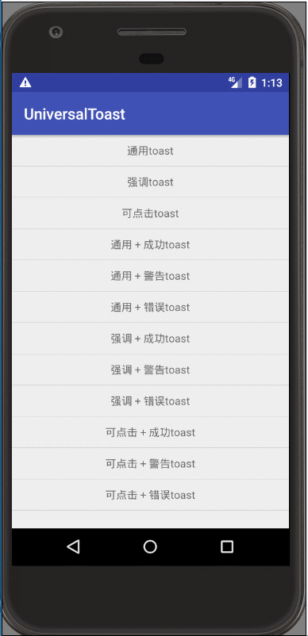
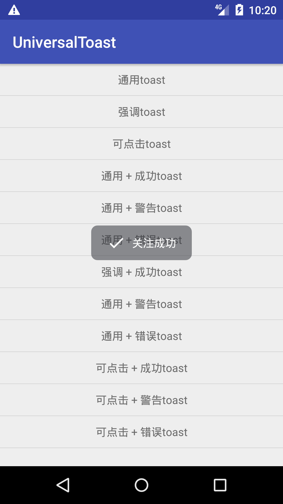
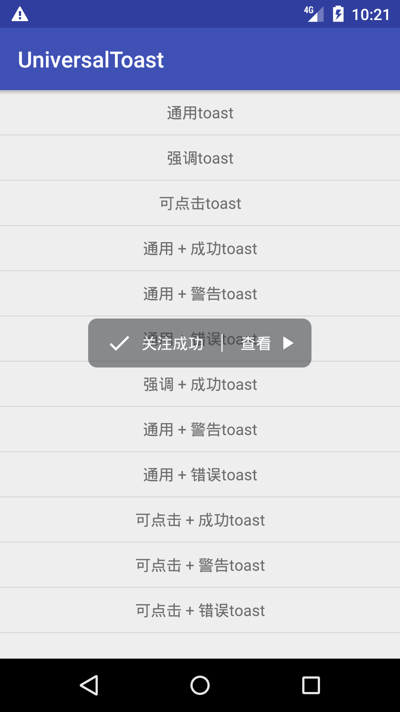
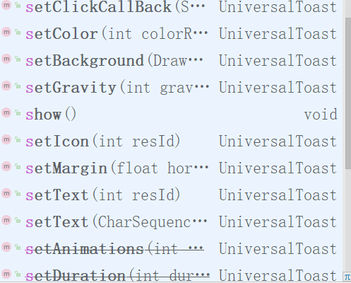
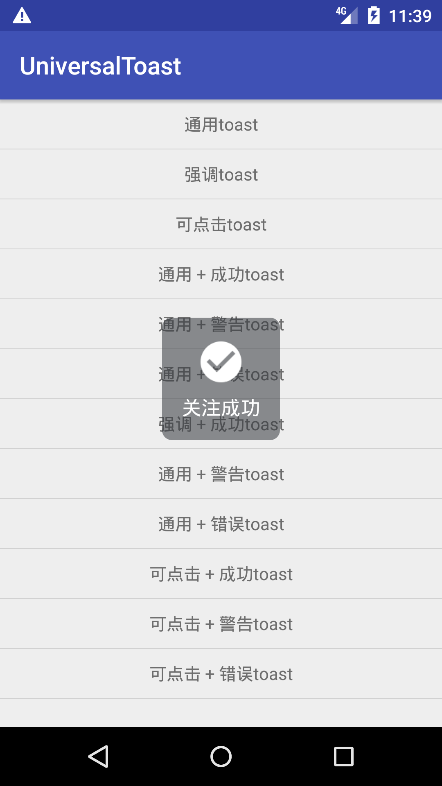
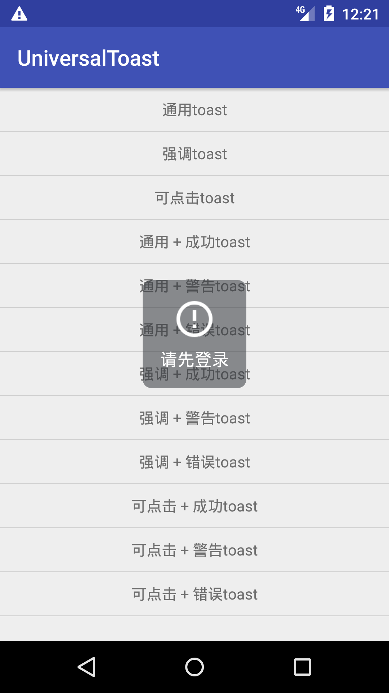
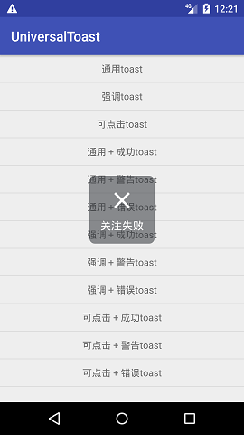

### UniversalToast：an elegant and flexible toast which can handle click event
[](https://jitpack.io/#bboylin/UniversalToast)
---

中文版文档请戳：[这里](./readme_zh.md)



#### features
* elegant & flexible
* can handle click event & custom duration (by adding view with WindowManager)
* auto avoid BadTokenException in android N (which cannot be caught in you application,cause it happens not in main thread)

#### Usages
* step 1 : add dependency
```gradle
allprojects {
    repositories {
        ......
        maven { url 'https://jitpack.io' }
    }
}

dependencies {
    ......
    compile 'com.github.bboylin:UniversalToast:v1.0.2'
}
```
* step 2 : simply use it like system toast
```java
UniversalToast.makeText(context, text, duration).show();
UniversalToast.makeText(context, text, duration,type).show();
```
`duration` must be either `UniversalToast.LENGTH_LONG` or `UniversalToast.LENGTH_SHORT`,
`type` must be one of `UniversalToast.UNIVERSAL` ,`UniversalToast.EMPHASIZE`,`UniversalToast.CLICKABLE`, by default `UniversalToast.UNIVERSAL`.





from left to right : `UNIVERSAL` ， `EMPHASIZE` ， `CLICKABLE` , you can set the icon and text as you like 。

* further api:


```java
//example
UniversalToast.makeText(context, text, UniversalToast.LENGTH_SHORT, UniversalToast.CLICKABLE)
              .setGravity(gravity,xOffset,yOffset)
              .setBackground(drawable)//set the background drawable as you like
              .setColor(R.color.my_color)//set the background color as you like
              .setIcon(R.drawable.my_ic)// set the icon as you like (it's visibility is gone until you set icon)
              .setClickCallBack(text,R.drawable.my_btn,onClickListener)
              .show();
```
it has been provided 3 basically default icons for you,you can use `showSuccess()`,`showWarning()` or `showError()` instead of `show()`





from left to right : `showSuccess` ， `showWarning` ， `showError` （the pics above shows the type `EMPHASIZE` ，you can also use `CLICKABLE` or `UNIVERSAL`）

#### notice:
using `UniversalToast.CLICKABLE` requires permission : `android.permission.SYSTEM_ALERT_WINDOW`

thanks to : [ToastCompat](https://github.com/drakeet/ToastCompat)