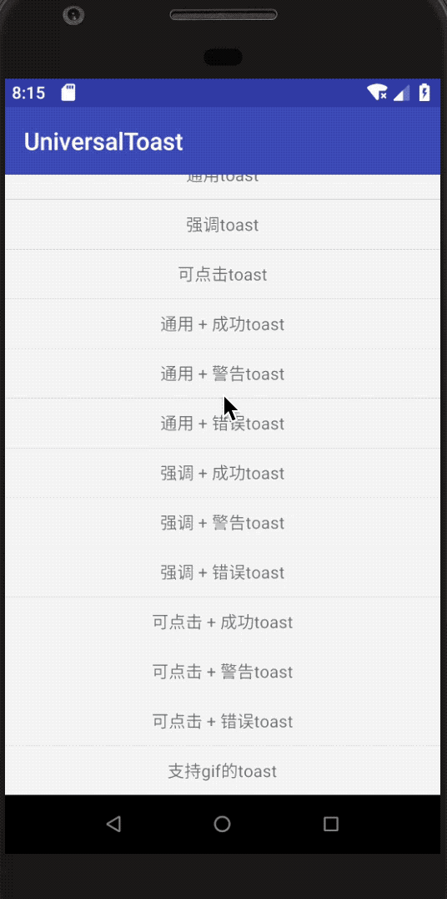
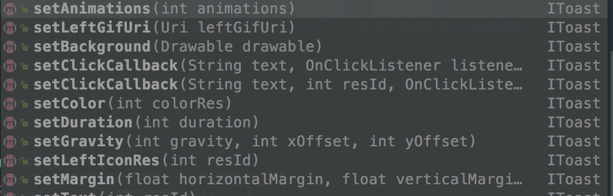
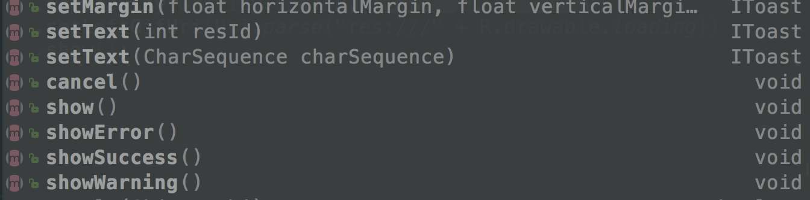

### UniversalToast：一个简洁优雅的toast组件，支持点击和GIF&安全
[](https://jitpack.io/#bboylin/UniversalToast)
---



#### features
* 优雅 & 灵活
* 可点击 & 可随意设置显示时长
* 主动避免android 7.0使用toast可能出现的BadTokenException
* 关闭通知权限后依然可以正常弹出
* 支持加载GIF，让你的toast更生动

#### Usages
* step 1 : 添加依赖
```gradle
allprojects {
    repositories {
        ......
        maven { url 'https://jitpack.io' }
    }
}

dependencies {
    ......
    implementation 'com.github.bboylin:UniversalToast:v1.0.9'
    // 请添加上fresco的依赖，可以把fresco版本替换成最新的
    implementation 'com.facebook.fresco:fresco:1.10.0'
    implementation 'com.facebook.fresco:animated-gif:1.10.0'
}
```

* step 2 : api类似原生toast
```java
UniversalToast.makeText(context, text, duration).show();
UniversalToast.makeText(context, text, duration,type).show();
```
`duration` 应该是`UniversalToast.LENGTH_LONG` 和`UniversalToast.LENGTH_SHORT`其中之一,
`type` 应该是 `UniversalToast.UNIVERSAL`  , `UniversalToast.EMPHASIZE` , `UniversalToast.CLICKABLE` 三者之一 , 未指定则默认为 `UniversalToast.UNIVERSAL`.


从左到右依次为`UNIVERSAL`，`EMPHASIZE`，`CLICKABLE`样式的toast，图标文字可设置。

* 更多API:




设置duration和设置动画的方法被废弃掉了，因为：
* 不建议自己修改toast显示时长
* 在android framework里限制了windowAnimations必须是系统动画。

```java
//example
UniversalToast.makeText(context, text, UniversalToast.LENGTH_SHORT, UniversalToast.CLICKABLE)
              .setGravity(gravity,xOffset,yOffset)
              .setBackground(drawable) // 设置背景
              .setColor(R.color.my_color) // 设置背景色
              .setLeftIconRes(R.drawable.my_ic) // 设置icon，未调用的话icon不可见(gone)
              .setLeftGifUri(uri) // 设置gif的uri，设置后setLeftIconRes方法会失效，即优先展示gif
              .setClickCallback(text,R.drawable.my_btn,onClickListener) //设置点击listener
              .show();
```
有三种默认的图标提供，用`showSuccess()`,`showWarning()` ， `showError()`代替`show()`即可采用对应的图标。


从左到右依次为 : `showSuccess` ， `showWarning` ， `showError` 的图标（这里只展示了`EMPHASIZE`类型的toast，`CLICKABLE`和`UNIVERSAL`亦可）

#### 注意:
由于Android 8.0对悬浮窗权限的限制，使用可点击的toast(即`UniversalToast.CLICKABLE`)必须允许悬浮窗权限:
```html
<uses-permission android:name="android.permission.SYSTEM_ALERT_WINDOW" />
```
关于如何动态申请权限请参考demo。</br>
Android 8.0以下无需悬浮窗权限。

#### minSdkVersion>=14

#### notice :

如果你遇到activity finish的时候toast cancel出现bug：


请将此处你的application context改为activity的context

感谢 : [ToastCompat](https://github.com/drakeet/ToastCompat)